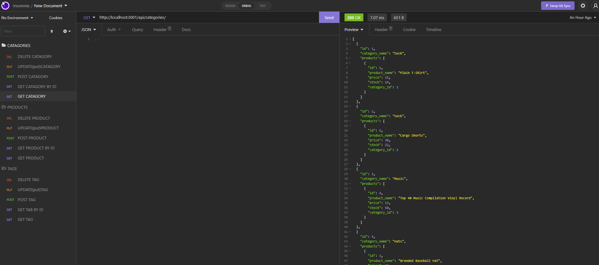
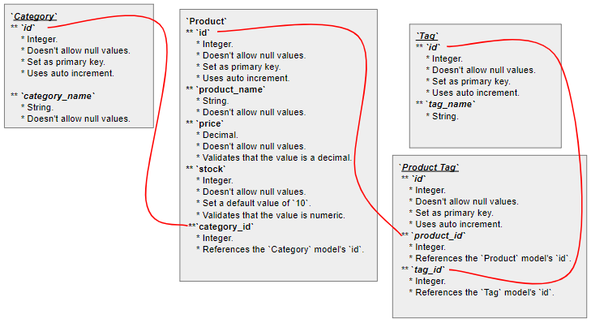

# E-Commerce-Back-End 

## Description
    This project was designed to keep track of a stores inventory as well as price to make keeping track of these things easier so a business owner can spend more time helping customers then making sure their Business is keeping up with supply and demand. 

## Installation
   To run this source code you will have to have Node.js, dotenv.js, express.js, mysql2.js, sequelize.js, and an API platform such as insomnia or postman.
   * Video: https://watch.screencastify.com/v/NG9AGbQzf5vQ67u7pyQY
   * GitHub: https://christopherponzio.github.io/E-Commerce-Back-End/
   * Repository: https://github.com/ChristopherPonzio/E-Commerce-Back-End

## Usage
    * To use this software you will need to add an env file with your password, username, and the database name of ecommerce_db
    * Once you open the file location in your terminal you will need to run "npm i" to install the needed packages. Aftwerwords mysql to upload the database. 
    * Once the database is uploaded you can use "npm run seeds" to add your stores specefic data from a seeds database.
    * Once your data base has been added you can use "npm start" to access the database and make changes as needed using your API software of choice. 

## Credits
    * Michelle Blackwell github: https://github/Mblackwellgca 
    * https://stackoverflow.com 
    * https://w3schools.com 
    * https://choosealicense.com 
    * https://img.shields.io
    * https://github.com
    * https://www.heroku.com
    * NODE.js
    * Dotenv.js
    * Mysql2.js
    * Sequelize.js

## License
    Licensed under the MIT license.
    https://choosealicense.com/licenses/mit